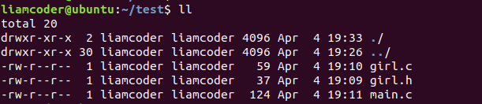
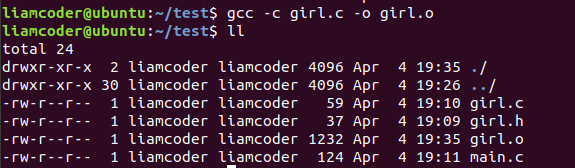
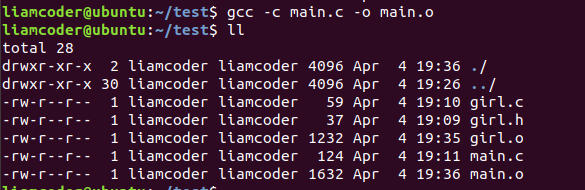
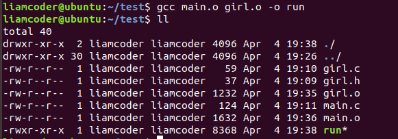
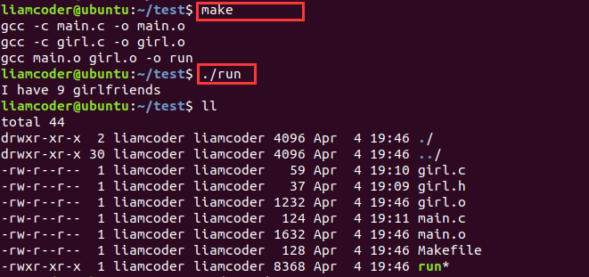
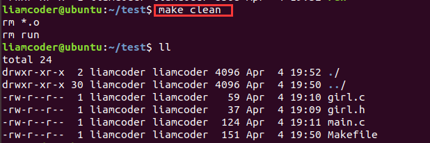

# gcc编译C代码以及Makefile文件的书写

[TOC]

### 一、如何用gcc编译C代码

如果只有单个文件，一般直接执行下面这条命令就可以进行编译了。

> 执行命令：gcc 文件名.c -o 目标文件名. 

如果目标文件名不写，则默认编译出a.out的目标文件(Linux环境下)。 

但是并不是想要一次性得到最终的.out文件，而是需要得到编译过程中的一些中间文件，例如汇编代码文件，那么就需要分步编译了。gcc的编译过程如下：


> - *预处理*：宏定义展开、头文件展开、条件编译等，同时将代码中的注释删掉，这里并不会检查语法；  
> - *编译*：检查语法，将预处理后的文件编译成汇编文件；  
> - *汇编*: 将汇编文件生成目标文件（二进制文件）；  
> - *链接*： C语言写的程序是需要依赖各种库的，所以编译之后还需要把库链接到可执行程序中去。  

步骤  | 命令  
--|--
预处理  | gcc -E hello.c -o hello.i    
编译  | gcc -S hello.i -o hello.s   
汇编  | gcc -c hello.s -o hello.o   
链接 | gcc hello.o -o hello_elf  
gcc命令详细：  

选项  | 含义   
--|--
"-E"  | 只进行预处理  
"-S"(大写)  | 只进行预处理和编译  
"-c"(小写)  | 只进行预处理、编译和汇编    
"-o file"  | 指定生成的输出文件名为file   


那么如果要同时编译多个文件怎么办呢？例如，以我下面这个工程目录为例：


在我的工程中，有girl.c, girl.h, main.c文件，而main.c是需要依赖girl文件的。

那么步骤是这样的：

- 先通过gcc -c girl.c -o girl.o编译出girl的目标文件
  
- 然后通过同样的方式编译出main.o文件
  
- 最后通过gcc main.o girl.o -o run编译出run可执行文件
  
- 通过./run就可以运行了


而Makefile文件就是将上述编译步骤写进一个文件，通过make命令自动完成编译，或者通过make clean命令将编译后生成的文件进行删除。


### 二、如何编写Makefile文件

Makefile文件就是一个纯文本文件，直接在工程目录下创建即可。然后，按照Makefile的书写规则进行书写。规则如下：

```
target ... : prerequisites ...
        command
        ...
        ...
```

- target也就是一个目标文件，简单的说就是，你想要得到的是什么。
- prerequisites就是，要生成那个target所需要的文件。
- command也就是make需要执行的命令。(任意的Shell命令)

这个规则可以这么看，目标文件target的生成需要依赖prerequisites中的一些文件，而target文件的生成规则是在command中定义的。

还是以上面的工程目录为例，可以这样书写我们的Makefile文件：

```makefile
run: main.o girl.o
	gcc main.o girl.o -o run

girl.o: girl.c
	gcc -c girl.c -o girl.o

main.o: main.c
	gcc -c main.c -o main.o
```

我们一般会把最终需要生成的目标文件放在开头。

书写完成后，可以通过make命令编译出可执行文件run，然后运行即可：


那么，如何编写clean将生成的目标文件和可执行文件删除呢？只需要将删除命令写在clean下面即可，但是要注意一般我们将clean放在文件末尾，千万别放在文件开头。

```makefile
run: main.o girl.o
	gcc main.o girl.o -o run

girl.o: girl.c
	gcc -c girl.c -o girl.o

main.o: main.c
	gcc -c main.c -o main.o

clean:
	rm *.o
	rm run

```

这样，就可以通过make clean文件进行删除就好了。



事实上，到这里为止，就已经具备了自己编写Makefile文件来构建自己C语言工程的能力，但是，如果想要写出更酷的Makefile文件，请接着往下读。


### 三、在Makefile中使用变量

我们也可以在Makefile中使用变量，来简化我们的重复代码的书写，例如，如果我们编译需要的依赖不是girl.o main.o这两个，而是girl1.o girl2.o gir3.o girl4.o girl5.o ..... gir100000.o这么多呢？花大量功夫去重复编写这样的代码恐怕就真的没空去find a girl了。所以，在Makefile中引入变量确实是必不可少的。

定义一个变量的语法也很简单

```
变量 = 多个文件名
```

如何使用这个变量呢？

```
$(变量)
```

然后，我们可以简单修改一下上面的Makefile文件，把main.o girl.o用变量objects来代替。

```makefile
objects = main.o girl.o
run: $(objects)
	gcc $(objects) -o run

girl.o: girl.c
	gcc -c girl.c -o girl.o

main.o: main.c
	gcc -c main.c -o main.o

clean:
	rm *.o
	rm run
```


### 四、Makefile的自动推导特性

make可以识别一个`.o`文件，自动将对应的`.c`文件加在依赖关系中。并且也会自动推导出相关的编译命令。有了这个特性，我们的Makefile文件就可以写的更加简洁了：

```makefile
objects = main.o girl.o
run: $(objects)
	gcc $(objects) -o run

clean:
	rm *.o
	rm run

```

可以看到，在填写依赖的时候，我们其实并不需要把头文件也放进去，因为在C代码中的#include语句已经可以自动帮我们打开头文件了，但是如果为了看起来更加直观，也可以在Makefile文件中添加：

```makefile
objects = main.o girl.o

run: $(objects)
	gcc $(objects) -o run

girl.o: girl.h

clean:
	rm *.o
	rm run

```

最后，再说一下关于clean的书写，有了上面的变量之后，可以如下书写clean指令：

```makefile
objects = main.o girl.o

run: $(objects)
	gcc $(objects) -o run

girl.o: girl.h

.PHONY: clean
clean:
	rm $(objects) run
```

这里的.PHONY表示clean其实是一个不存在的伪文件。