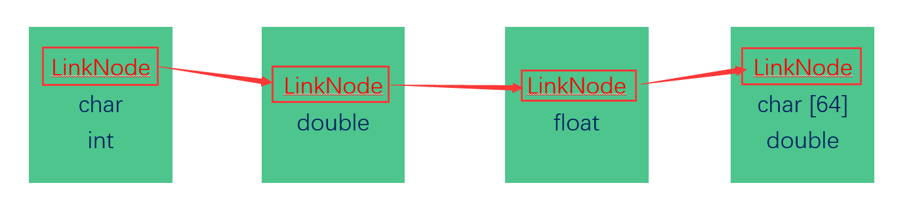

# 内核链表——一种可以存放不同数据类型的通用链表

传统的链表在很多应用程序开发中广泛使用，但不适用于操作系统内核的编写。传统链表有一个很大的局限性，就是很难将不同类型的数据串联起来，而接下来将要介绍的“内核链表”就解决了这一问题，使之可以用来串联不同的数据类型，有点类似于python中的list。

传统的链表结点一般会有两个成员，一个为数据域，用于存放自己这种数据类型的数据，另一个为指针域，用于指向下一个结点。其结构体定义一般类似于下面的代码：

```C
typedef struct LINKNODE{
    int data;
    struct LINKNODE* next;
}LinkNode;
```

这样的话，每一种数据类型都得定义一个属于自己的链表结点，显得太麻烦。

内核链表的设计思想是这样的：

在链表结点中只设定一个指向下一结点的指针域，而自己的数据类型中，将这种链表结点当作是自己的一个成员变量。

链表结点：

```C
typedef struct LINKNODE{
    struct LINKNODE* next;  
}LinkNode;
```


```C
typedef struct Person{
    LinkNode node;
    char name[64];
    int age;
}Person;
```

这样的话，就相当于每一种自己定义的数据类型，有了一个“钩子”可以指向下一个结点。就好比挂衣服一样，不同种类的衣服，可以通过同一种晾衣架串联起来。


在进行数据的增、删、查、改操作的时候，将指向该结点的指针类型转换为LinkNode*类型进行操作，因为在自己定义的数据结构中，只有LinkNode这一数据域才与该数据在链表中的位置关系有关联，换句话说，只有这个数据域才起到“串联”作用。


接来下我们来看一下具体代码。

linklist.h中定义了与链表有关的相关结构：

```C
#ifndef LINKLIST_H
#define LINKLIST_H

typedef struct LINKNODE{
    struct LINKNODE* next;  
}LinkNode;

typedef struct LINKLIST{
    LinkNode head;
    int size;
}LinkList;

typedef void(*PRINTNODE)(LinkNode*);
typedef int(*COMPARE)(LinkNode*, LinkNode*);

// interface
LinkList* Init_LinkList();
void Insert_LinkList(LinkList *list, int pos, LinkNode* data);
void Remove_LinkList(LinkList *list, int pos);
int Find_LinkList(LinkList *list, LinkNode* data, COMPARE cmp);
void Print_LinkList(LinkList *list, PRINTNODE print);
void Free_LinkList(LinkList *list);


#endif
```

这里面的各种操作都和传统链表差不多，实现这些接口也不难，可以参考我的代码：<https://github.com/liamlycoder/liam_ucore_os/blob/master/codes/extension/linklist/linklist.c>

上面的代码中需要注意的有两点：

- 在进行打印操作的时候，究竟以何种方式进行打印不是该链表结构说了算的，而应该把打印方式通过函数指针类型的参数留给用户指定，用户可以根据自己的数据类型进行自定义打印函数。
- 同样，在进行查找操作的时候，不能草率的通过==符号来进行判断是否相等，而应该把“比较”这一操作通过函数指针作为参数的形式交由用户(这里采用纯C，不支持重载运算符)。

于是，用户可以在自己的数据中这样来使用该链表：

```C
#include <stdio.h>
#include <string.h>
#include "linklist.h"

typedef struct Person{
    LinkNode node;
    char name[64];
    int age;
}Person;

// 实现自己的打印函数
void MyPrint(LinkNode* data) {
    Person* p = (Person*)data;
    printf("name:%s, age:%d\n", p->name, p->age);
}

// 实现自己的“比较”函数
int MyCompare(LinkNode* data1, LinkNode* data2) {
    Person* p1 = (Person*)data1;
    Person* p2 = (Person*)data2;
    return (strcmp(p1->name, p2->name) == 0 && p1->age == p2->age);

}
```

然后，在main函数中创建自己的数据：

```C
int main()
{
    LinkList* list = Init_LinkList();

    // generate some data;
    Person p1, p2, p3, p4, p5;
    strcpy(p1.name, "Liam");
    p1.age = 22;
    strcpy(p2.name, "Lizzy");
    p2.age = 21;
    strcpy(p3.name, "SB_yu_hao");
    p3.age = 2;
    strcpy(p4.name, "Jobs");
    p4.age = 156;
    strcpy(p5.name, "Bill Gates");
    p5.age = 175;
    
    return 0;
}

```

如何将它们插入链表中呢？

```C
Insert_LinkList(list, 0, (LinkNode*)&p1);
Insert_LinkList(list, 0, (LinkNode*)&p2);
Insert_LinkList(list, 0, (LinkNode*)&p3);
Insert_LinkList(list, 0, (LinkNode*)&p4);
Insert_LinkList(list, 0, (LinkNode*)&p5);
```

插入的时候，先取用户自定义数据类型的地址，然后将其转换为LinNode*类型，相当于缩小其访问的范围，然后可以通过链表中的函数进行插入操作。

而在打印的时候，可以将自定义的打印函数传入：

```C
Print_LinkList(list, MyPrint);
```

当然，到这里可能会有疑问，如果链表中存放的是不同的数据类型，其打印函数也各不相同，该如何传递呢？其实相信有各种编程技巧可以完善这一点，比如设置flag标识各种类型等，但是由于在编写操作系统的时候往往是针对链表进行增、删、查、改操作而不是进行全部数据的打印，所以这里我也没有对其进行实现。

删除元素和查找元素的过程与上述类似：

```C
Remove_LinkList(list, 2);
Person tmp;
strcpy(tmp.name, "Jobs");
tmp.age = 156;

printf("---------------------------------------\n");
printf("Finding the Jobs...\n");
int pos = Find_LinkList(list, (LinkNode*)&tmp, MyCompare);
printf("The position is:%d\n", pos);
```

这样就完成了该链表，是不是很酷？

完整代码：<https://github.com/liamlycoder/liam_ucore_os/tree/master/codes/extension/linklist>