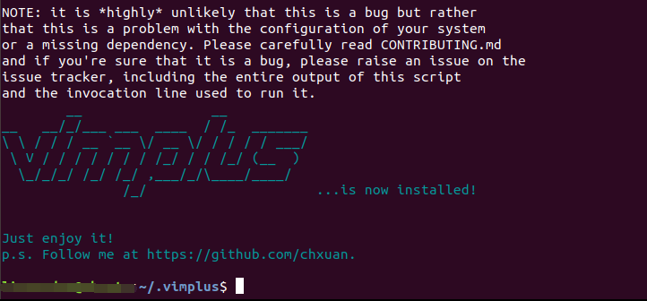
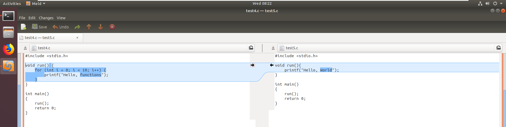

# 实验0-实验环境的准备

### 1-给Linux添加回收站

我们知道，Linux中的删除命令rm，删除后是找不回的，但是我们可以通过alias修改rm删除文件的路径。   

1. 在用户目录下新建.trash目录作为回收站

   ```shell
   mkdir ~/.trash
   ```

   

2. 修改配置文件.bashrc

   ```shell
   # 修改rm
   alias rm=trash
   alias r=trash
   alias rl='ls ~/.trash/'
   alias ur=recoverfile
   alias mcls=cleartrash
   
   recoverfile()
   {
       mv -i ~/.trash/$@ ./
   }
   
   trash()
   {
       mv $@ ~/.trash
   }
    
   cleartrash()
   {
       read -p "clear sure?[n]" confirm
       [ $confirm == 'y' ] || [ $confirm == 'Y' ] && /bin/rm -rf ~/.trash/*
   }
   
   ```

3. 执行```source .bashrc```使配置文件生效


这样，我们使用rm命令实际上就是将要删除的文件移动到回收站。  

- rl：查看回收站内容  
- ur + 文件：从回收站中恢复删除的文件  
- mcls：清空回收站


### 2-配置vim文件

在Linux上当然得用强大的vim来编写代码了，这里采用了国内大牛开发的vim-plus来进行编写。  

安装及使用方法见github：<https://github.com/chxuan/vimplus>  

当然，如果发现在虚拟机上通过git命令clone来自github上的项目太慢的话，请自行Google一下解决办法，网上特别多。一般是通过修改把github的域名解析添加到本地hosts文件中去，以节省很多域名解析的时间。事实证明，这种方法特别有效。  

不过，即使github可以以正常速度访问了，整个安装过程也是极度漫长，这期间可以边喝咖啡边和妹子聊聊天。。。  

安装完了应该会看到这样一个画面：  



### 3-安装代码比较工具meld

Meld是一个可视的diff和合并工具。Meld是Linux软件，用户使用它可以比较2至3个文件并进行编辑，也可以比较2至3个文件夹并同时进行文件对比。  

安装命令：

```shell
sudo apt-get install meld
```

然后通过meld命令即可运行。 例如:
```shell
meld test4.c test5.c
```

这样就可以显示两份代码之间的区别，可以用来进行对比。  




### 4-QEMU

QEMU是一套由法布里斯·贝拉(Fabrice Bellard)所编写的以GPL许可证分发源码的模拟处理器，在GNU/Linux平台上使用广泛。Bochs，PearPC等与其类似，但不具备其许多特性，比如高速度及跨平台的特性，通过KQEMU这个闭源的加速器，QEMU能模拟至接近真实电脑的速度。  

好了，上面这段文字来源于百度百科。  

简单的说，qemu就是一个用来虚拟机用来运行我们编写的操作系统。

当然，安装的话，通过命令行直接安装即可，如有问题自行Google。  


### 5-gdb调试工具

Linux应该不用安装，一般都自带了。所以这个工具主要是学习一下它的使用。

在图形化界面下，我们经常会使用断点调试的方法来分析或者debug我们的代码，但是在命令行下呢，这里的gdb工具就是用命令行来调试C/C++代码的。

在开始实验之前，有必要学习一下gdb调试的基本使用。  


### 6-Makefile文件

如果已经完成了上述工具的安装，那么这里还需要学习Makefile文件的编写，用来构建我们的C/C++项目。因为在学校很少会教Makefile语法，所以这部分内容只能靠自己补齐了。  


当然，如果安装好了上述工具，以及学会了它们的使用，就可以开始正常实验了。不过，首先得问问自己C语言学的怎么样，以及，x86的汇编学的怎么样。